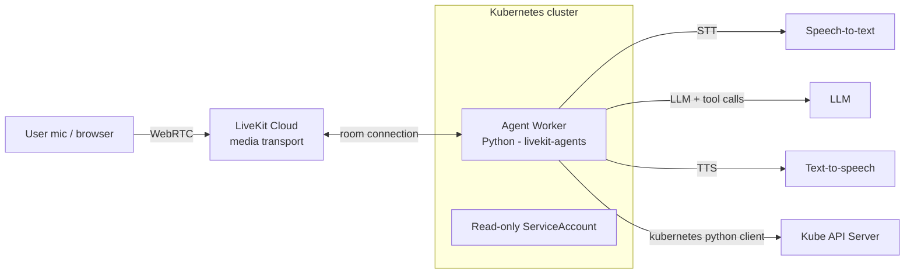

# KubeVoice

A voice AI agent, built on [LiveKit Agents](https://docs.livekit.io/agents/) (Python), that answers spoken questions about the Kubernetes cluster it runs inside — "How many pods are running in payments?", "Any problems in the cluster?", "What's the status of orders-batch?" — and reports back in natural speech.

<!-- Drop demo GIF/video here once recorded:

-->

## What it does

- Runs as a LiveKit Agents worker, deployed on Kubernetes via Helm, with **read-only** access to the cluster it lives in.
- Exposes a handful of function tools (pod listing, deployment status, recent events, node health) that the agent calls in response to spoken questions.
- Speaks the answer back in a form meant for listening, not reading — summarized, not a JSON dump.
- Runs the same code locally against a `kind` cluster during development and inside the cluster in production, via one Helm chart.



The agent worker dials **out** to LiveKit Cloud for media transport — no Service, Ingress, or public IP is needed on the cluster side.

## Why I built this

I've spent the last ~18 months building agentic AI systems (see [my other work](#)) and wanted to learn the LiveKit Agents framework hands-on by building something real rather than following the quickstart verbatim. Voice felt like the natural next interface after a career built mostly around infrastructure and, more recently, text-based agents — and "an agent that can talk about the cluster it's running on" was a way to combine both halves of my background in one project.

## Design decisions

- **Read-only by design.** The agent's ClusterRole grants only `get`/`list`/`watch` on pods, events, nodes, and deployments — never write access. A voice interface to infrastructure mutation needs confirmation flows, audit trails, and probably a different UX entirely; I scoped that out deliberately rather than bolt it on unsafely. See [What's next](#whats-next).
- **Cloud transport, self-hosted worker.** Rather than self-hosting the full LiveKit media server, the worker uses LiveKit Cloud for WebRTC transport and only the compute-heavy agent logic runs on my cluster. This is the split most LiveKit customers actually run in production, and it kept the project's scope achievable in a focused build rather than turning into a media-infra project.
- **Tool output is shaped for speech, not for a debugger.** Early on, my Kubernetes tools returned the raw Kubernetes API response straight to the LLM — full `managedFields`, timestamps, owner references, the works. It worked, but it was slow and wasteful: the model was reading kilobytes of noise to say one sentence. Tools now return a small, pre-summarized structure (name, namespace, phase, restart count, human-readable reason) so the model has exactly what it needs to say the answer aloud. *(Status: implemented / in progress — update once done.)*
- **Blocking Kubernetes calls are moved off the event loop.** The official `kubernetes` Python client is synchronous; calling it directly inside an async tool blocked the event loop long enough to visibly starve the VAD (`inference is slower than realtime` in the logs). Wrapping those calls in `asyncio.to_thread` fixed it. *(Status: implemented / in progress — update once done.)*
- **`kind` over a cloud cluster for development.** A local `kind` cluster is a fully conformant, reproducible Kubernetes environment — real RBAC, real Helm — without any cloud cost or teardown discipline required. The Helm chart itself is distribution-agnostic; see [What's next](#whats-next) for cloud deployment.

## Running it

Full step-by-step setup — installing kind/Helm/kubectl, creating the cluster, seeding demo workloads (including two deliberately broken ones for the agent to diagnose), building the image, and deploying via Helm — is in **[SETUP.md](./SETUP.md)**.

Quick version once everything is installed:
```bash
kind create cluster --config demo-cluster/kind-config.yaml
kubectl apply -f demo-cluster/seed/demo-workloads.yaml

cd agent && uv sync && uv run python src/agent.py download-files
uv run python src/agent.py dev   # talk to it via LiveKit's agent playground/console

# containerize and deploy
docker build -t kubevoice-agent:0.1.0 .
kind load docker-image kubevoice-agent:0.1.0 --name kubevoice
kubectl create namespace kubevoice
kubectl -n kubevoice create secret generic kubevoice-secrets --from-env-file=.env
helm install kubevoice ../deploy/kubevoice --namespace kubevoice
```

## Current state

- [x] Voice agent working end-to-end locally (console/dev mode) against a live `kind` cluster
- [x] Deployed via Helm, running inside the cluster it queries, read-only RBAC enforced
- [x] Correctly diagnoses seeded failures (ImagePullBackOff, CrashLoopBackOff) and reports them in natural speech
- [x] Tool-output shaping for latency/cost
- [x] Async wrapper for blocking Kubernetes calls
- [ ] Demo recording
- [x] Observability (Prometheus/OpenTelemetry metrics)
- [ ] Evals (LiveKit Agents testing framework)

## What's next

- **Write operations with confirmation flows** — currently strictly read-only by design; a safe path to remediation (e.g. "restart the crash-looping pod?" with explicit confirmation) is the natural next step.
- **Observability** — export worker metrics (Prometheus) and traces (OpenTelemetry) from inside the cluster.
- **Evals** — automated test cases for the tool-calling behavior using LiveKit's Agents evaluation framework.
- **SIP/telephony ingress** — LiveKit supports dialing in over the phone network; a natural extension for an on-call use case.
- **Cloud deployment** — the Helm chart is distribution-agnostic; validating on AKS/EKS alongside `kind` would round this out.

## Repo layout

```
agent/                  # LiveKit Agents worker (Python, uv-managed) + Dockerfile
demo-cluster/           # kind cluster config + seed manifests (incl. deliberately broken pods)
deploy/kubevoice/       # Helm chart: Deployment, read-only RBAC, health probes
SETUP.md                # full step-by-step setup instructions
```
