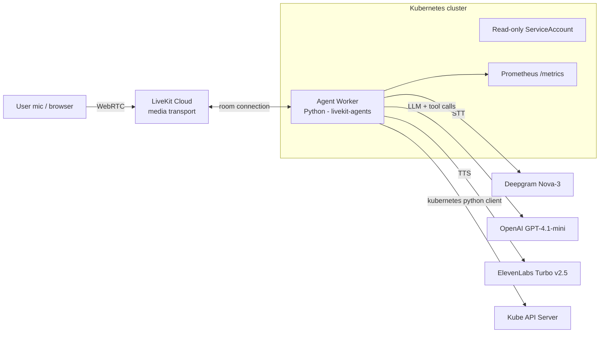

# KubeVoice

A voice AI agent, built on [LiveKit Agents](https://docs.livekit.io/agents/) (Python), that answers spoken questions about the Kubernetes cluster it runs inside — "How many pods are running in payments?", "Any problems in the cluster?", "What's the status of orders-batch?" — and reports back in natural speech. Speech to text runs on Deepgram Nova-3; text to speech runs on ElevenLabs (Turbo v2.5) via the ElevenLabs plugin, with LiveKit Cloud handling WebRTC transport and an OpenAI model doing the reasoning.

<!-- Drop demo GIF/video here once recorded:

-->

## What it does

- Runs as a LiveKit Agents worker, deployed on Kubernetes via Helm, with **read-only** access to the cluster it lives in.
- Exposes function tools (cluster/pod status, namespace events) that the agent calls in response to spoken questions.
- Speaks the answer back in a form meant for listening, not reading — summarized, not a JSON dump.
- Runs the same code locally against a `kind` cluster during development and inside the cluster in production, via one Helm chart.
- Exposes Prometheus metrics for its own tool usage and latency, and has an automated eval suite covering tool-use correctness, grounding, and graceful failure.



The agent worker dials **out** to LiveKit Cloud for media transport — no Service, Ingress, or public IP is needed on the cluster side.

## Why I built this

I've spent the last ~18 months building agentic AI systems and wanted to learn the LiveKit Agents framework hands-on by building something real rather than following the quickstart verbatim. Voice felt like the natural next interface after a career built mostly around infrastructure and, more recently, text-based agents — and "an agent that can talk about the cluster it's running on" was a way to combine both halves of my background in one project.

## Design decisions

- **Read-only by design.** The agent's ClusterRole grants only `get`/`list`/`watch` on pods, events, nodes, and deployments — never write access. A voice interface to infrastructure mutation needs confirmation flows, audit trails, and probably a different UX entirely; I scoped that out deliberately rather than bolt it on unsafely. While testing, I asked the agent to dictate an exact `kubectl patch` command for copy-paste — the command it generated was correct every time (confirmed in logs), but the console UI's transcript rendering corrupted the nested JSON quoting on display. That reinforced the read-only decision: precision-critical commands don't belong in a conversational surface, voice or text. See [What's next](#whats-next) for a safer path to remediation.
- **Own API keys over the inference gateway.** The first version used LiveKit Cloud's inference gateway with a model string (`deepgram/nova-3:multi`), which works but routes STT through LiveKit's Deepgram account. I swapped to the `livekit-plugins-deepgram` plugin with my own API key. The practical differences: usage and latency are now visible in my own provider console, and model parameters are set in code rather than encoded in a string. The gateway is the right default for a quick start; the plugin is the right choice once you want to see and control what the STT/TTS layer is doing.
- **The voice layer is pluggable.** STT and TTS sit behind LiveKit's plugin interfaces, so a provider can be swapped without touching the agent logic, the tools, or the deployment. `main` runs one TTS provider and the `elevenlabs-tts` branch runs another (ElevenLabs Turbo v2.5); both share the same agent, tools, and Helm chart. Keeping the pipeline vendor-neutral means the choice of voice provider is a configuration decision, not an architectural one. Two practical notes from wiring in ElevenLabs on this branch: some ElevenLabs voices are restricted to paid tiers, so a free-tier account needs a voice available on its plan; and the ElevenLabs plugin reads its key from the `ELEVEN_API_KEY` environment variable, not the `ELEVENLABS_API_KEY` name I had used elsewhere, which is an easy mismatch to miss.
- **The hard part of the swap was deployment wiring, not code.** Changing the TTS provider in the agent was two lines. Getting it running in-cluster took longer, and none of it was agent logic: the Kubernetes Secret needed the new key, the deployment template had to actually map that key into the container (I moved it to `envFrom` so every secret key flows through and I stop hitting this), and the env var name had to match what the plugin expects. It all worked locally in `dev` mode from the start because that reads `.env.local` directly; the container only ever gets what the chart wires in. This gap between "works on my laptop" and "works in the cluster" is the recurring theme of the project.
- **Cloud transport, self-hosted worker.** Rather than self-hosting the full LiveKit media server, the worker uses LiveKit Cloud for WebRTC transport and only the compute-heavy agent logic runs on my cluster. This is the split most LiveKit customers actually run in production, and it kept the project's scope achievable in a focused build rather than turning into a media-infra project.
- **Tool output is shaped for speech, not for a debugger.** Early on, my Kubernetes tools returned the raw Kubernetes API response straight to the LLM — full `managedFields`, timestamps, owner references, the works. It worked, but it was slow and wasteful: the model was reading kilobytes of noise to say one sentence. Tools now return a small, pre-summarized structure (pod name, namespace, phase, restart count, human-readable reason). Measured latency after the fix: `get_cluster_status` averages ~47ms, `get_namespace_events` ~13-20ms — see [Observability](#observability) for how these numbers were captured.
- **Blocking Kubernetes calls are moved off the event loop.** The official `kubernetes` Python client is synchronous; calling it directly inside an async tool blocked the event loop long enough to visibly starve the VAD (`inference is slower than realtime`, 0.83s delay, in the logs). Wrapping those calls in `asyncio.to_thread` fixed it — the same Prometheus histogram that surfaced the original delay now confirms tool latency staying almost entirely under 100ms.
- **`kind` over a cloud cluster for development.** A local `kind` cluster is a fully conformant, reproducible Kubernetes environment — real RBAC, real Helm — without any cloud cost or teardown discipline required. The Helm chart itself is distribution-agnostic; see [What's next](#whats-next) for cloud deployment.

## Observability

Prometheus metrics are exposed on `:9091/metrics` — `kubevoice_tool_calls_total` (by tool and outcome), `kubevoice_tool_latency_seconds` (histogram), and `kubevoice_k8s_api_errors_total`.

This turned out to be less trivial than "add a metrics endpoint": LiveKit's worker runs job code in a separate spawned OS process from the top-level worker process hosting the endpoint, so a naive single-process Prometheus setup silently reported zero samples — the counters were real, just incrementing in a different process's memory than the one being scraped. Fixed using `prometheus_client`'s multiprocess mode (the same mechanism used for multi-worker Gunicorn apps), where each process writes metric deltas to a shared directory and the endpoint aggregates across them on scrape. A secondary bug then surfaced from the same root cause as an earlier Docker snag: the metrics directory was being created (and root-owned) at image-build time rather than at real runtime, making it unwritable by the non-root runtime user — fixed by deferring directory creation to the actual worker startup path only.

As a side effect, the same setup surfaces LiveKit's own built-in worker-health metrics (`lk_agents_active_job_count`, `lk_agents_proc_initialize_duration_seconds`, `lk_agents_worker_load`) for free, since they're also `prometheus_client`-based and land in the same multiprocess directory.

Not yet wired up: LiveKit's per-turn AI-component metrics (LLM TTFT, STT/TTS latency, end-of-turn delay) and LiveKit Cloud's hosted Agent Observability dashboard (session replay, transcripts) — both are available given this already runs on LiveKit Cloud for transport, and are natural next additions. See [What's next](#whats-next).

## Evals

An automated eval suite (`agent/tests/test_agent.py`) uses LiveKit Agents' testing framework — text-only, no audio pipeline, no live cluster required, run via pytest against a real LLM. Five tests cover: greeting/persona, correct tool invocation (vs. answering from an ungrounded guess), grounding accuracy (the spoken summary must match a mocked tool output exactly, no invented or dropped details), graceful degradation on a simulated cluster error, and misuse resistance (off-topic input must not trigger a real tool call).

Writing these caught a real bug: `get_cluster_status`'s `namespace` parameter was typed `str` with a default of `None`, so when the model correctly tried to query the whole cluster (sending `null`), Pydantic validation rejected it — the model then silently retried with `""` and succeeded, meaning every whole-cluster query was burning a wasted round-trip hidden inside the transcript. Fixed by typing the parameter `Optional[str]`.

Also worth noting for anyone extending this suite: LLM-judged evals inherit variance from both the agent's own live model call and the judge's. Two tests flickered between pass/fail across identical runs early on — not from a code change, but because natural-language intent assertions need to target the actual invariant that matters (e.g. "must not fabricate weather data") rather than one specific phrasing the model happened to produce once. Tightening the test inputs and loosening over-literal intent wording resolved this; it's a real characteristic of this testing style, not something to chase away with retries.

## Running it

Full step-by-step setup — installing kind/Helm/kubectl, creating the cluster, seeding demo workloads (including two deliberately broken ones for the agent to diagnose), building the image, and deploying via Helm — is in **[SETUP.md](./SETUP.md)**.

To configure credentials, copy `.env.example` (repo root) to `agent/.env.local` for running the agent locally, and to `agent/.env` for creating the cluster secret. You will need LiveKit credentials and a `DEEPGRAM_API_KEY` — a free Deepgram account includes $200 of credit.

This branch also requires an `ELEVEN_API_KEY` (ElevenLabs). A free ElevenLabs account works, but note some voices are restricted to paid tiers; use a voice available on your plan.

Quick version once everything is installed:
```bash
kind create cluster --config demo-cluster/kind-config.yaml
kubectl apply -f demo-cluster/seed/demo-workloads.yaml

cd agent && uv sync && uv run python src/agent.py download-files
uv run python src/agent.py dev   # talk to it via LiveKit's agent playground/console

# run the eval suite
uv run pytest tests/test_agent.py -v

# containerize and deploy
docker build -t kubevoice-agent:0.1.5 .
kind load docker-image kubevoice-agent:0.1.5 --name kubevoice
kubectl create namespace kubevoice
kubectl -n kubevoice create secret generic kubevoice-secrets --from-env-file=.env
helm install kubevoice deploy/kubevoice --namespace kubevoice

# check metrics once deployed
kubectl -n kubevoice port-forward deploy/kubevoice 9091:9091
curl -s localhost:9091/metrics | grep kubevoice
```

## Current state

- [x] Voice agent working end-to-end locally (console/dev mode) against a live `kind` cluster
- [x] Deployed via Helm, running inside the cluster it queries, read-only RBAC enforced
- [x] Correctly diagnoses seeded failures (ImagePullBackOff, CrashLoopBackOff) and reports them in natural speech
- [x] Tool-output shaping for latency/cost
- [x] Async wrapper for blocking Kubernetes calls
- [x] Observability — multiprocess-aware Prometheus metrics (tool calls, latency, errors), verified in-cluster
- [x] Evals — 5 behavioral tests (greeting, tool-use correctness, grounding, graceful degradation, misuse resistance); caught a real type-hint bug along the way
- [x] Pluggable voice layer — runs on the Deepgram plugin (`main`) and the ElevenLabs plugin (this branch) behind the same agent and Helm chart
- [ ] Demo recording

## What's next

- **Custom web frontend** — currently interacting through LiveKit Cloud's hosted agent console; a purpose-built UI (e.g. based on LiveKit's `agent-starter-react`) would let this run as a standalone demo independent of the Cloud dashboard, and is the more realistic shape of how an FDE customer would actually integrate this into their own tooling.
- **Write operations with confirmation flows** — currently strictly read-only by design; a safe path to remediation (e.g. applying a pre-validated patch via the Kubernetes API directly, with explicit confirmation, rather than dictating shell syntax for a human to retype) is the natural next step.
- **Voice-pipeline metrics and session observability** — wire up LiveKit's per-turn AI-component metrics (LLM/STT/TTS latency, end-of-turn delay) and enable LiveKit Cloud's Agent Observability dashboard for session replay and transcripts.
- **SIP/telephony ingress** — LiveKit supports dialing in over the phone network; a natural extension for an on-call use case.
- **Cloud deployment** — the Helm chart is distribution-agnostic; validating on AKS/EKS alongside `kind` would round this out.

## Repo layout

```
agent/                  # LiveKit Agents worker (Python, uv-managed) + Dockerfile
  src/agent.py          # agent, tools, entrypoint
  src/metrics.py         # multiprocess-aware Prometheus metrics
  tests/test_agent.py   # eval suite (LiveKit Agents testing framework)
demo-cluster/           # kind cluster config + seed manifests (incl. deliberately broken pods)
deploy/kubevoice/       # Helm chart: Deployment, read-only RBAC, health + metrics ports
SETUP.md                # full step-by-step build log and setup instructions
```